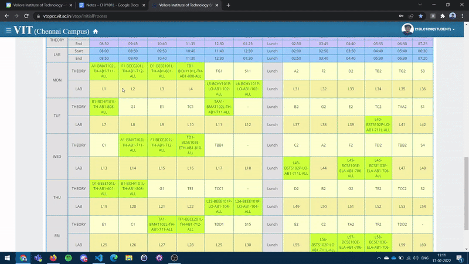

> Disclamer: 🚧 This is a work in progress. Check out [TODOs](#todo)

# Compare TT

> Compare VIT Timetables with ease! 🔥

[Link to the live site](https://lenincodes.co/compare-tt)

With this static site, you can compare timetable with your classmates without needing to read through it. 

> Note- This has only been tested with VIT Chennai timetable. It might not work for other campuses. Please raise an issue if you face any problems

## How to use

1. Copy your timetable and paste it in the first textbox
1. Have someone send over their time table and paste in the second textbox
1. Hit submit! ⚡

## Tech stack used

HTML, CSS(barely) and JS!

## How it works

I have used RegEx to identify the course code and venue to determine if you have same classes or not

## Contributions 😍

You are more than welcome to raise an issue if you want to add a feature or report any bug. 

### TODO

- [ ] add styling (pure css??)
- [ ] add description in the site how to use the web app 
- [ ] add feature to store common classes with your friends (Local Storage API)

**Make sure to raise an issue before making a PR**

Happy coding! 😛
